# Weather_app

## 📱 Mô tả dự án

Ứng dụng Weather App (Dự báo thời tiết) được xây dựng bằng Flutter, cho phép người dùng xem thông tin thời tiết hiện tại và dự báo trong tương lai theo vị trí hiện tại hoặc các thành phố yêu thích.

Ứng dụng sử dụng API thời tiết (OpenWeatherMap), kết hợp với quản lý trạng thái bằng Provider, giúp dữ liệu được cập nhật realtime và giao diện phản hồi nhanh chóng.

## 🎬 Demo

👉 [Video Demo](https://drive.google.com/drive/folders/1QElrrhJGq0Prv9bpMtkMictZsVq20vTy?usp=sharing)

## 🚀 Các tính năng chính

- Lấy vị trí hiện tại
- Thời tiết hiện tại
- Dự báo theo giờ
- Dự báo 5 ngày
- Tìm kiếm thành phố
- Thành phố yêu thích
- Nhập vị trí thủ công
- Cài đặt cá nhân

---

## Hướng dẫn thiết lập API (Bảo mật khóa)

1. Tạo file .env
Thêm API key vào file

```bash
OPEN_WEATHER_API_KEY=your_openweather_api_key
```

2. Thêm .env vào .gitignore
3. Trong main thêm 

```bash
await dotenv.load();
```

4. Sử dụng API key trong code

```bash
import 'package:flutter_dotenv/flutter_dotenv.dart';

final apiKey = dotenv.env['OPEN_WEATHER_API_KEY'];
```

---

## Sản phẩm

<div align="center">
  <table>
    <tr>
      <td>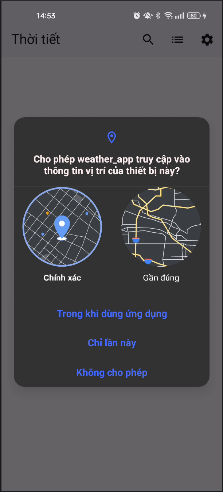</td>
      <td>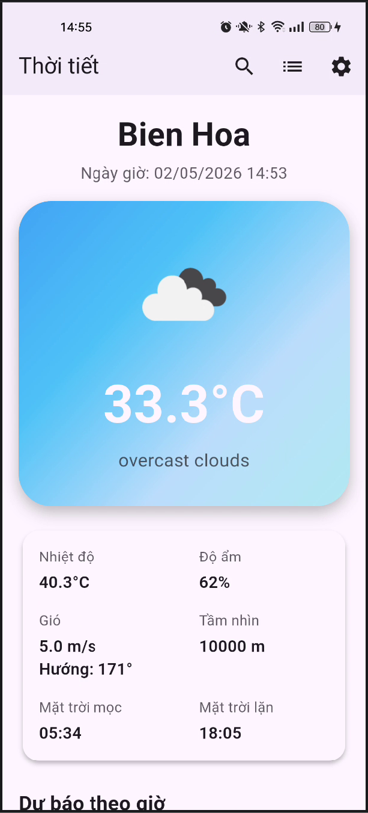</td>
      <td>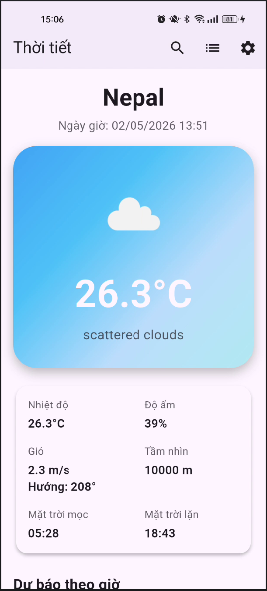</td>
      <td>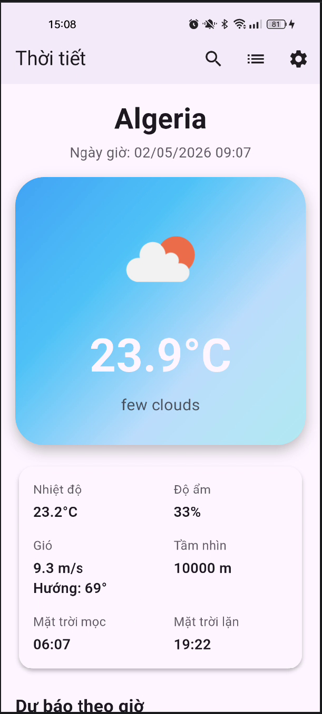</td>
    </tr>
    <tr>
      <td>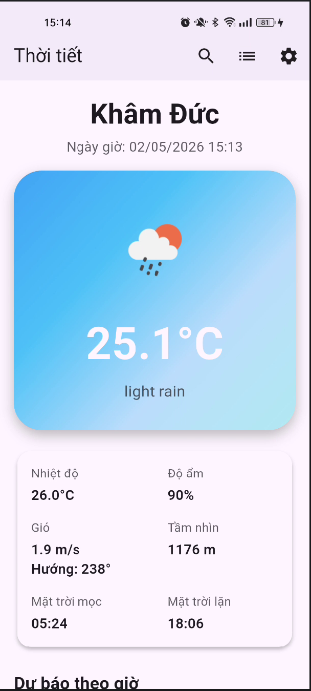</td>
      <td>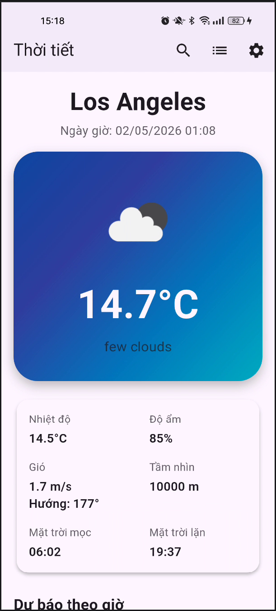</td>
      <td>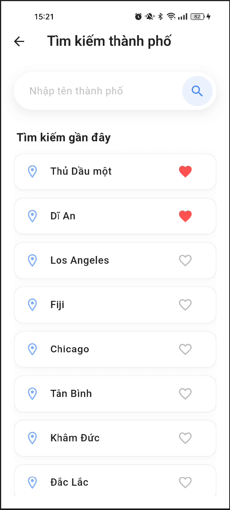</td>
      <td></td>
    </tr>
    <tr>
      <td>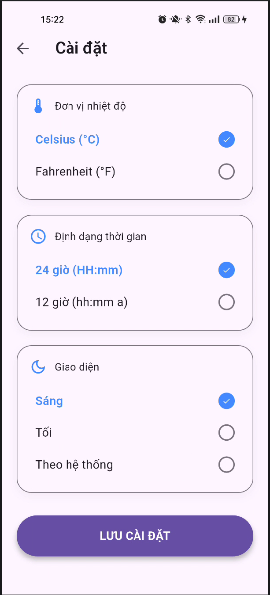</td>
      <td>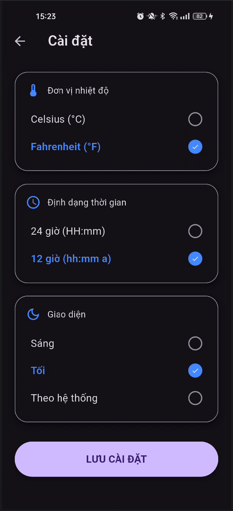</td>
      <td>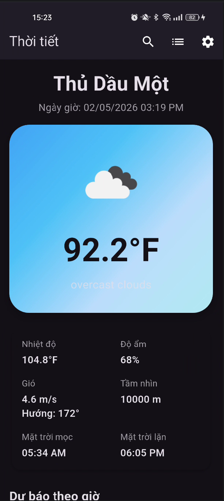</td>
      <td>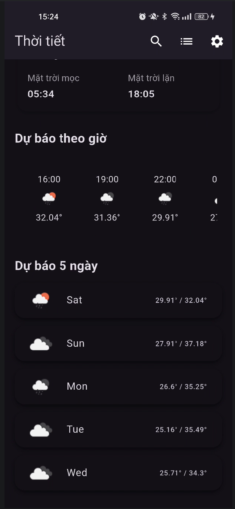</td>
    </tr>
  </table>
</div>

---

## Công nghệ sử dụng 

- Flutter
- REST API (OpenWeatherMap)
- Provider (State Management)
- Geolocator
- Geocoding
- SharedPreferences (Local Storage)

---

## Cấu trúc dự án

```bash
lib/
├── assets/
│   ├── cities.dart
│
├── config/
│   ├── api_config.dart
│
├── models/
│   ├── weather_model.dart
│   ├── forecast_model.dart
│   ├── hourly_weather_model.dart
│   └── location_model.dart
│
├── services/
│   ├── weather_service.dart
│   ├── location_service.dart
│   └── storage_service.dart
│
├── providers/
│   ├── weather_provider.dart
│   └── location_provider.dart
│
├── screens/
│   ├── home_screen.dart
│   ├── search_screen.dart
│   ├── manuailocation_screen.dart
│   └── settings_screen.dart
│
├── widgets/
│   ├── current_weather_card.dart
│   ├── hourly_forecast_list.dart
│   └── daily_forecast_card.dart
│
└── main.dart
```

---

## 🚀 Hướng dẫn chạy dự án

1. Clone project từ Git

```bash
git clone https://github.com/Noname2k4/flutter_weather_app_VuHoangHiep
cd weather_app
```

2. Chạy ứng dụng

```bash
flutter pub get
flutter run
```

---

## Hạn chế 

- Ứng dụng phụ thuộc vào API từ OpenWeatherMap nên yêu cầu kết nối Internet ổn định để hoạt động.
- Dữ liệu thời tiết có thể bị chậm hoặc không chính xác hoàn toàn do phụ thuộc vào nguồn API bên thứ ba.
- Giao diện chưa tối ưu hoàn toàn cho tất cả kích thước màn hình.
- Chưa có tính năng lưu dữ liệu offline, không thể xem khi mất mạng.
- Chưa hỗ trợ đa ngôn ngữ.


---

## Hướng phát triển

- Hỗ trợ chế độ offline (cache dữ liệu)
- Tối ưu UI/UX cho tablet và iPad
- Tích hợp đa ngôn ngữ (i18n)
- Cải thiện hiệu năng và giảm thời gian tải dữ liệu